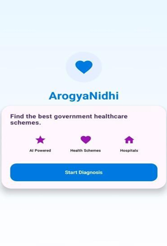
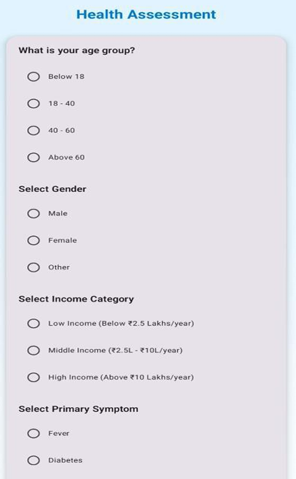
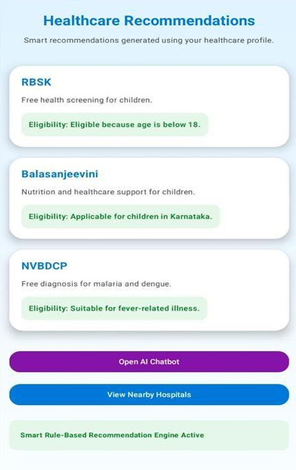
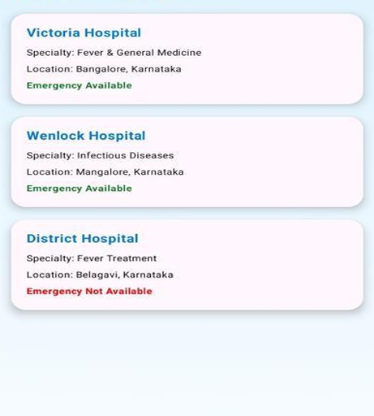
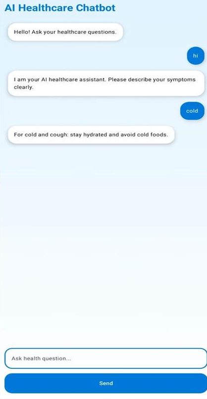

# 🏥 ArogyaNidhi – AI-Based Government Health Scheme Recommendation System

## 📌 Overview

ArogyaNidhi is an AI-assisted Android application that helps users identify government health schemes based on their eligibility and personal profile.

The application simplifies the process of finding suitable healthcare benefits by recommending relevant schemes through an easy-to-use interface.
## Problem Statement

Many citizens are unaware of government healthcare schemes they are eligible for, making it difficult to access available medical benefits.

ArogyaNidhi addresses this challenge by collecting basic user information such as age, gender, income category, and primary health symptoms. Based on this information, the application recommends suitable government healthcare schemes, provides nearby hospital information, and offers AI-assisted healthcare guidance through an integrated chatbot.


## 🔄 Application Workflow

```text
User Login
     ↓
Health Assessment
     ↓
Eligibility Analysis
     ↓
Government Scheme Recommendation
     ↓
Nearby Hospital Suggestions
     ↓
AI Healthcare Chatbot
```
---
## ✨ Key Features

- 🤖 AI-assisted government health scheme recommendations
- 📋 User eligibility-based scheme matching
- 📱 Android-friendly interface
- 🔍 Simple and intuitive user experience
- ⚡ Fast recommendation workflow
- 🏥 Focused on improving access to government healthcare schemes

---
## 🛠️ Technologies Used

- Java
- Android Studio
- Firebase
- Gemini API
- JSON Dataset

---

### 🏠 Home Screen



---

### 📝 Health Assessment



---

### 💡 Government Healthcare Recommendations



---

### 🏥 Nearby Hospitals



---

### 🤖 AI Healthcare Chatbot



---
## 👨‍💻 My Contribution

This project was designed and developed individually as part of my AI and Android application development journey.

### My responsibilities included:

- Designed and developed the complete Android application.
- Integrated Firebase Authentication and backend services.
- Developed the health assessment questionnaire.
- Implemented AI-powered healthcare scheme recommendation using Gemini API.
- Created eligibility-based recommendation logic using a structured JSON dataset.
- Developed nearby hospital recommendation functionality.
- Integrated an AI healthcare chatbot for basic medical guidance.
- Designed and tested the complete user interface using Android Studio.

---
## 🚀 Future Improvements

- Support for additional government healthcare schemes across different states.
- Multi-language support to improve accessibility.
- AI-powered symptom analysis for more personalized recommendations.
- Integration with official government healthcare APIs.
- Real-time hospital availability and appointment booking.
- Enhanced chatbot capabilities for healthcare guidance.

---
